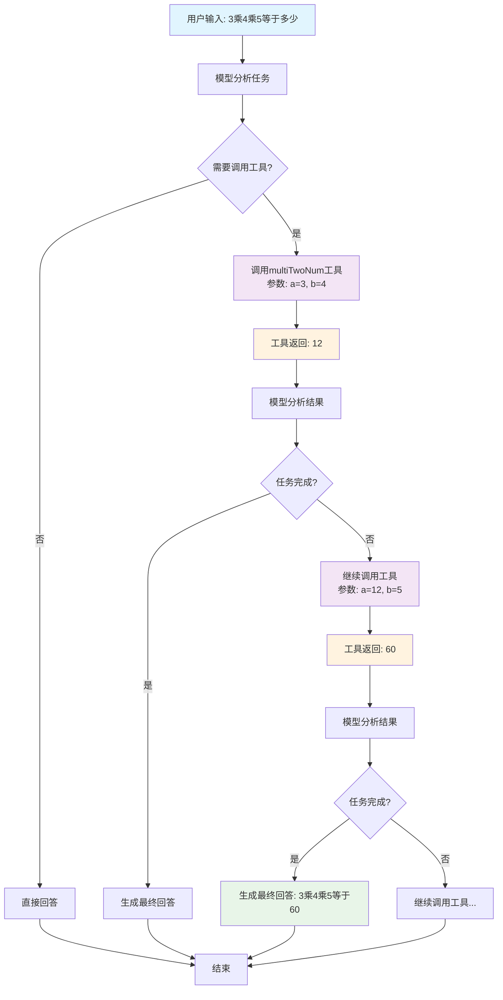

> 这个教程是一边学习一边写的，中间可能会出现一些疏漏或者错误，如果您看到该篇文章并且发现了问题，还请多多指教！

### 1. Agent

#### a. 定义

在刚刚接触大模型相关的学习的时候，我们很容易复杂化 ``agent`` 的概念，比如在 cursor 中的 ``agent`` 模式下，接收我们输入的命令后它会进行一系列操作，看起来十分复杂和高大上（确实它的功能也很复杂），但我们抽象和简化一下它的流程，例如我们输入的指令是：“帮我创建一个 React 日期组件”，它的将会进行这几个步骤

1. 接收用户数据
2. 分析用户输入并产生决策：调用生成代码工具
3. 工具调用，输入需求以及技术栈和其他上下文，输出 React 代码
4. 检查代码是否符合要求并产生决策：返回或者是进一步修改代码
5. 返回结果

如果用 ai 自己的定义来说，``agent`` 就是一个能够自主决策和行动的AI系统。

#### b. 创建一个 agent

在刚刚接触前端的时候，我们一定都了解或者接触过 ``柯里化函数（curry function）`` 的概念，我们在这里借助一下这个概念来类比我们的例子。现在我们的需求是计算多个数的乘值并返回，而我们提供给大模型的 `tool` 只支持接收两个参数，那么要处理多个数的计算，模型就需要分析并决策是否使用工具还是返回答案。我们来实现一下这个需求。

```ts
import { tool } from "@langchain/core/tools";
import { MessagesAnnotation, StateGraph } from "@langchain/langgraph";
import { ToolNode, toolsCondition } from "@langchain/langgraph/prebuilt";
import { ChatOllama } from "@langchain/ollama";
import z from "zod";

const multiTool = tool((input) => {
  return input.a * input.b + ''
}, {
  name: 'multiTwoNum',
  description: '获取两个数的乘积',
  schema: z.object({
    a: z.number().describe('需要相乘的第一个数字'),
    b: z.number().describe('需要相乘的第二个数字'),
  })
})

const toolNode = new ToolNode([multiTool])

const llm = new ChatOllama({
  model: 'qwen3:8b',
}).bindTools([multiTool])

const callModel = async (input: typeof MessagesAnnotation.State) => {
  const systemMessage = {
    role: "system",
    content: `你是一个数学计算助手。当用户需要计算时，你必须使用提供的工具进行计算。
    重要规则：
    1. 不要只分析问题，要立即行动
    2. 对于多个数字的计算，分步进行
    3. 每次调用工具后，根据结果决定下一步
    4. 获取到最终结果后需要输出答案
    `
  }
  const res = await llm.invoke([
    systemMessage,
    ...input.messages
  ])
  return {
    messages: [res]
  }
}

const workflow = new StateGraph(MessagesAnnotation)
.addNode('callModel', callModel)
.addNode('tool', toolNode)
.addEdge('__start__', 'callModel')
.addConditionalEdges('callModel', toolsCondition, {
  __end__: "__end__",
  tools: "tool",
})
.addEdge('tool', 'callModel')

const app = workflow.compile()

const res = await app.invoke({
  messages: '3乘4乘5等于多少'
})

console.log(res)
```

控制台打印如下

```json
{
  messages: [
    HumanMessage {
      "id": "78871de8-9fd6-4d4a-855f-44c163d3c661",
      "content": "3乘4乘5等于多少",
      "additional_kwargs": {},
      "response_metadata": {}
    },
    AIMessage {
      "id": "2ed647aa-195d-43b9-b0b6-046dd6ac3b9d",
      "content": "<think>\n好的，用户问的是3乘4乘5等于多少。我需要使用提供的工具来计算。首先，工具里有一个multiTwoNum函数，可以计算两个数的乘积。但用户的问题是三个数相乘，所以我得分步来。\n\n先算前两个数，3乘4。调用multiTwoNum函数，参数a是3，b是4。得到结果12之后，再用这个结果乘以5。这时候再调用一次函数，参数a是12，b是5。这样两次调用后，最终结果应该是60。需要确保每一步都正确，然后输出答案。\n</think>\n\n",
      "additional_kwargs": {},
      "response_metadata": {
        "model": "qwen3:8b",
        "created_at": "2025-08-26T13:27:14.898469Z",
        "done_reason": "stop",
        "done": true,
        "total_duration": 3787750041,
        "load_duration": 46858333,
        "prompt_eval_count": 241,
        "prompt_eval_duration": 189409458,
        "eval_count": 165,
        "eval_duration": 3549962459
      },
      // 工具调用信息
      "tool_calls": [
        {
          "name": "multiTwoNum",
          "args": {
            "a": 3,
            "b": 4
          },
          "id": "880cc620-690f-4b89-98f6-46184bd9b576",
          "type": "tool_call"
        }
      ],
      "invalid_tool_calls": [],
      "usage_metadata": {
        "input_tokens": 241,
        "output_tokens": 165,
        "total_tokens": 406
      }
    },
		// 调用工具获取结果
    ToolMessage {
      "id": "57b3fdd8-1dbd-4d6e-9c81-13a19e5504d3",
      "content": "12",
      "name": "multiTwoNum",
      "additional_kwargs": {},
      "response_metadata": {},
      "tool_call_id": "880cc620-690f-4b89-98f6-46184bd9b576"
    },
    AIMessage {
      "id": "84afb157-e9e6-4852-b642-bb248c2e3e9a",
      "content": "<think>\n好的，用户需要计算3乘4乘5的结果。首先，我应该分步骤进行，因为工具只能处理两个数的乘积。第一步，先计算3和4的乘积，调用multiTwoNum函数，得到12。接下来，用这个结果12再乘以5，再次调用multiTwoNum函数，得到最终结果60。确保每一步都正确，然后输出答案。\n</think>\n\n",
      "additional_kwargs": {},
      "response_metadata": {
        "model": "qwen3:8b",
        "created_at": "2025-08-26T13:27:18.043522Z",
        "done_reason": "stop",
        "done": true,
        "total_duration": 3137011208,
        "load_duration": 38836875,
        "prompt_eval_count": 394,
        "prompt_eval_duration": 300466916,
        "eval_count": 120,
        "eval_duration": 2794757375
      },
      // 第二次工具调用信息
      "tool_calls": [
        {
          "name": "multiTwoNum",
          "args": {
            "a": 12,
            "b": 5
          },
          "id": "2fa88f7d-0182-4792-8e14-8a76a8d3f298",
          "type": "tool_call"
        }
      ],
      "invalid_tool_calls": [],
      "usage_metadata": {
        "input_tokens": 394,
        "output_tokens": 120,
        "total_tokens": 514
      }
    },
		// 第二次工具调用的结果
    ToolMessage {
      "id": "dc6c86b3-50ce-4ec4-a6b9-4800fed51d51",
      "content": "60",
      "name": "multiTwoNum",
      "additional_kwargs": {},
      "response_metadata": {},
      "tool_call_id": "2fa88f7d-0182-4792-8e14-8a76a8d3f298"
    },
    AIMessage {
      "id": "aab573bf-46de-419c-bfcf-6be0d47d9929",
      "content": "<think>\n好的，用户的问题是3乘4乘5等于多少。我需要分步计算。首先用3和4相乘，得到12。然后用12乘以5，得到60。所以最终答案是60。确保每一步都正确，然后输出结果。\n</think>\n\n3乘4乘5的计算步骤如下：\n1. 先计算3×4=12\n2. 再计算12×5=60\n\n最终结果是60。",
      "additional_kwargs": {},
      "response_metadata": {
        "model": "qwen3:8b",
        "created_at": "2025-08-26T13:27:20.946555Z",
        "done_reason": "stop",
        "done": true,
        "total_duration": 2893118625,
        "load_duration": 38764292,
        "prompt_eval_count": 502,
        "prompt_eval_duration": 123403750,
        "eval_count": 106,
        "eval_duration": 2726048250
      },
      "tool_calls": [],
      "invalid_tool_calls": [],
      "usage_metadata": {
        "input_tokens": 502,
        "output_tokens": 106,
        "total_tokens": 608
      }
    }
  ]
}
```

分析控制台的输出，我们可以看到有两条 tool message，大模型决策调用哪个工具后通过通过 tool_calls 来输出调用信息。运行的过程如下




1. 分析输入“3乘4乘5等于多少”，调用工具传入 3 和 4
2. 获取到工具输出后进行分析，得出现在还未完成任务，继续做出调用工具的决策
3. 获取到最终输出并生成回答

这个决策过程其实对应了我们定义流程时使用 `addConditionalEdges` 添加的条件路径，`toolsCondition` 是一个 ``LangGraph`` 内置的条件判断，内置的原理其实就是检查最后一条 message 消息的类型是否包含工具调用，如果我们自己实现的话简化逻辑如下

```ts
function toolsCondition(state) {
  const lastMessage = state.messages[state.messages.length - 1];
  
  // 如果最后一条消息包含工具调用
  if (lastMessage.tool_calls && lastMessage.tool_calls.length > 0) {
    return "tools"; // 需要执行工具
  }
  
  // 如果最后一条消息是普通回复
  return "__end__"; // 任务完成，返回结果
}
```

到这一步我们实现了一个简单的 agent，虽然简单但是它具备了 agent 的所有特性，区别于我们前面两章简单的线性过程。

### 2. Tool

在开发大模型应用中 ``tool`` 是一个不可或缺的概念，如果说 ``agent`` 是一个拥有自主判断和行动能力的人，那么 ``tool`` 就是这个人的手。比如我们要访问数据库的某些数据，获取一些复杂的结果，再或者常见的的商业产品基本上都支持联网搜索，这里面其实就是存在一个“搜索网页结果”的工具。在 ``agent`` 小节中我们定义了一个乘法工具，让我们深入研究一下相关的代码作用。

```ts
import { tool } from "@langchain/core/tools";
import { MessagesAnnotation, StateGraph } from "@langchain/langgraph";
import { ToolNode, toolsCondition } from "@langchain/langgraph/prebuilt";
import { ChatOllama } from "@langchain/ollama";
import z from "zod";

const multiTool = tool((input) => {
  return input.a * input.b + ''
}, {
  name: 'multiTwoNum',
  // 工具的描述
  description: 'get multi result of two num',
  // 定义工具的参数
  schema: z.object({
    a: z.number().describe('需要相乘的第一个数字'),
    b: z.number().describe('需要相乘的第二个数字'),
  })
})

// 定义一个工具节点，在上面的流程中我们定义了当接收到 Tool Message 的时候进入这个节点并调用相关的工具
const toolNode = new ToolNode([multiTool])

const llm = new ChatOllama({
  model: 'qwen3:8b'
}).bindTools([multiTool]) // 让大模型能够调用绑定的工具，没有这一步的话大模型不知道自身具有哪些工具
```

### 3. 内置 Agent

对于上面的实现，``LangGraph`` 内置了一个 ``createReactAgent`` api 来创建 ``agent``，我们尝试改写一下上面的代码。

```ts
import { tool } from "@langchain/core/tools";
import { createReactAgent } from "@langchain/langgraph/prebuilt";
import { ChatOllama } from "@langchain/ollama";
import z from "zod";

const multiTool = tool((input) => {
  return input.a * input.b + ''
}, {
  name: 'multiTwoNum',
  description: 'get multi result of two num',
  schema: z.object({
    a: z.number().describe('需要相乘的第一个数字'),
    b: z.number().describe('需要相乘的第二个数字'),
  })
})

const llm = new ChatOllama({
  model: 'qwen3:8b'
}).bindTools([multiTool])

const agent = createReactAgent({
  llm,
  tools: [multiTool],
});

const res = await agent.invoke({
  messages: [
    ['system', `你是一个数学计算助手。当用户需要计算时，你必须使用提供的工具进行计算。
    重要规则：
    1. 不要只分析问题，要立即行动
    2. 对于多个数字的计算，分步进行
    3. 每次调用工具后，根据结果决定下一步
    4. 获取到最终结果后需要输出答案
    `],
    ['user', '3乘4乘5等于多少']
  ]
})

console.log(res)
```

第一小节的 agent 对于我们来说是一个白箱，内部如何流转是我们定义的。框架提供的api创建的是一个黑箱，内部帮我们连接了模型调用和工具节点。当我们需要细粒度的控制应用的功能时，可以自己编排逻辑；如果是简单任务可以使用内置 api 创建。

### 4.小结

这一章节我们初步学习了 agent 的定义以及如何开发 agent 和 tool，这些内容在我们后续学习其他部分时会经常使用到

